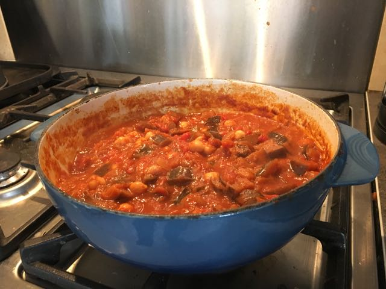

# Aubergine Curry
**Joe Baker**

I love aubergine. I haven't always, but I do now. This recipe is one of my own invention, inspired by an aubergine curry cooked for me by my friend Shila. Shila cooked an aubergine curry for us one evening. It was so delicious that I quizzed her about what she'd done as we ate, and then tried desperately not to forget what she'd said.

It's astonishingly simple, but time and patience is the key.

***Serves 4–6. Vegan. Preparation time: 15 mins. Cooking time: 2hrs at least, 3 is better***

## Ingredients

You'll need a heavy-bottomed saucepan.

- 2 medium aubergines
- ***lots*** of salt
- 2 medium onions
- 3 cloves of garlic
- 2 tbsps olive oil
- 2 tsps curry powder
- 2 bay leaves
- 5 cloves
- 5 cardamom pods
- 500ml of vegetable stock (at least)

#### Optionally …

- tin of tomatoes
- tin of chick peas

## Method

1. Chop the aubergines into large chunks, the size of a chunky chip, no longer than 2cm. Put all the pieces into a large bowl. Liberally sprinkle with salt and toss with your hands to cover all the aubergine chunks thoroughly with salt. Set aside. After 5 mins or so you should start to see the aubergine pieces 'sweat' as moisture leaches out of them.
2. Finely chop your onions. Fry in a heavy-bottomed pan with the olive oil until the onions are *very* soft. For best results, fry on a high heat for the first couple of minutes, until there's some caramelised browning at the edges of some of the onions. Then, turn the heat down very low. Finely chop the garlic and add to the onions as you turn the heat down. Continue to for 10+ minutes until the onions are completely translucent.
3. Wash the aubergine chunks thoroughly to remove the salt.
4. Add to the onions and garlic. Fry for 2 or 3 mins to start the aubergine softening.
5. Add the curry powder, mixing thoroughly to ensure all the aubergine pieces are coated. Continue to fry for another 2 or 3 minutes.
6. Add approximately a third of the vegetable stock, enough to ensure all the aubergine is bathed in stock. Add the bay leaves, cloves and cardamom. Bring to the boil, then take the heat down so the mixture is just simmering. 
7. Stir every 20/30 mins. Allow the simmering curry to reduce right down before adding more stock, as necessary. You may not use up all the stock; you may need to add more. At the end, the liquid should be almost completely reduced. The longer you can allow the dish to simmer the better it will taste - 2hrs is the minimum; 3hrs and the flavour is much, much better.

8. Optionally, you may want to add tomatoes and/or chick peas to the meal. The tomatoes make the curry much sweeter than otherwise, and is a delicious variant. If you do, add them for the last hour of simmering only.

Serve with pilau rice and chapati, and some mango chutney or cucumber and mint raita on the side.